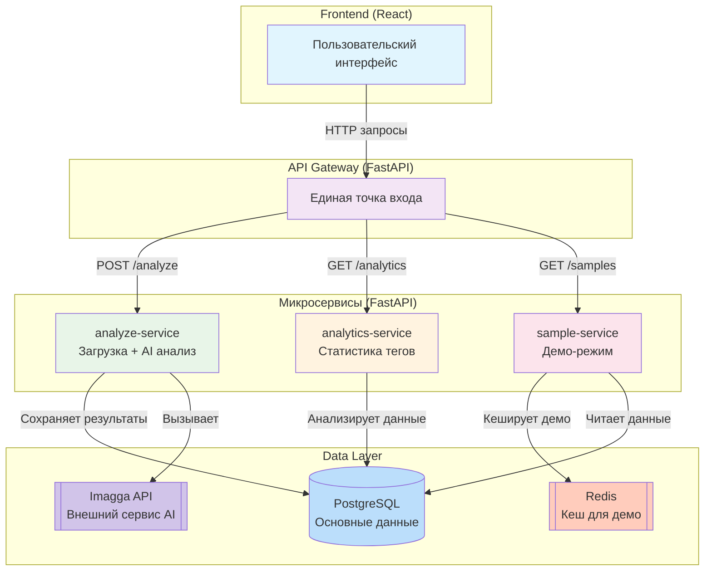

```mermaid

graph TB
    subgraph "Frontend (React)"
        UI[Пользовательский интерфейс]
    end
    
    subgraph "API Gateway (FastAPI)"
        GW[Единая точка входа]
    end
    
    subgraph "Микросервисы (FastAPI)"
        S1[analyze-service<br/>Загрузка + AI анализ]
        S2[analytics-service<br/>Статистика тегов]
        S3[sample-service<br/>Демо-режим]
    end
    
    subgraph "Data Layer"
        DB[(PostgreSQL<br/>Основные данные)]
        Cache[["Redis<br/>Кеш для демо"]]
        ExtAPI[[Imagga API<br/>Внешний сервис AI]]
    end
    
    UI -- "HTTP запросы" --> GW
    
    GW -- "POST /analyze" --> S1
    GW -- "GET /analytics" --> S2
    GW -- "GET /samples" --> S3
    
    S1 -- "Сохраняет результаты" --> DB
    S1 -- "Вызывает" --> ExtAPI
    
    S2 -- "Анализирует данные" --> DB
    
    S3 -- "Кеширует демо" --> Cache
    S3 -- "Читает данные" --> DB
    
    style UI fill:#e1f5fe
    style GW fill:#f3e5f5
    style S1 fill:#e8f5e8
    style S2 fill:#fff3e0
    style S3 fill:#fce4ec
    style DB fill:#bbdefb
    style Cache fill:#ffccbc
    style ExtAPI fill:#d1c4e9
```
