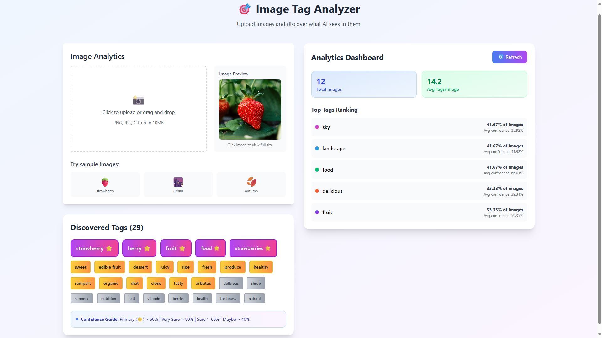

# Image Tag Analyzer

> **Узнай, что ИИ видит на твоих изображениях**  
> *Открой скрытые теги и смыслы в своих визуалах* 🔍


## 🎯 Что такое Image Tag Analyzer?

**Image Tag Analyzer** — это full-stack веб-приложение, которое использует продвинутое компьютерное зрение для автоматического определения и извлечения тегов из ваших изображений. Загрузите любую картинку и узнайте, что искусственный интеллект видит в ней!

### ✨ Зачем нужен Image Tag Analyzer?

- 🤖 **Анализ на основе ИИ** - Технология компьютерного зрения от Imagga
- 🚀 **Молниеносная скорость** - Асинхронный бэкенд для оптимальной производительности
- 📊 **Панель аналитики** - Отслеживайте статистику использования и популярные теги
- 🎨 **Современный UI** - Адаптивный дизайн для всех устройств
- 🆓 **Попробуй перед загрузкой** - Примеры изображений для мгновенного тестирования ИИ

## 🚀 Image Tag Analyzer Live

### 👉 **[Попробовать Image Tag Analyzer](https://imagetaganalyzer.rdeaps.com)** 👈

**Регистрация не требуется!** Просто загрузите изображение или нажмите на примеры для мгновенного старта.

## 📸 Скриншот

<details>
    <summary>🏠 Главный интерфейс</summary><br>
    
</details>

## 🏗️ Архитектура: Микросервисы на практике

Этот проект — **эксперимент с микросервисной архитектурой** на реальном примере. Цель: понять на практике принципы распределенных систем.

**Схема микросервисов ([подробнее](https://github.com/bravekirty/ImageTagAnalyzer/blob/main/Microservices_Diagram.md)):**

- **API Gateway (FastAPI)** - Единая точка входа
- **analyze-service** - Загрузка + AI-анализ изображений
- **analytics-service** - Статистика тегов и аналитика
- **sample-service** - Демо-режим с кешированием в Redis
- **Frontend (React)** - Отдельное SPA-приложение

Все сервисы развернуты в **Kubernetes (Minikube)** с полным описанием инфраструктуры как кода.

## 🛠️ Технологический стек

### **Бэкенд** *(Основной фокус)*

- **Python** - Основной язык программирования
- **FastAPI** - Современный, быстрый веб-фреймворк для создания API
- **SQLAlchemy** - SQL toolkit и Object-Relational Mapping (ORM)
- **PostgreSQL** - Продакшен база данных
- **Redis** - Кеширование endpoints
- **Async/Await** - Высокопроизводительные асинхронные операции
- **Kubernetes** - Оркестрация контейнеров и инфраструктура как код

### **Фронтенд**

- **React** - Современная JavaScript библиотека для пользовательских интерфейсов
- **Tailwind CSS** - Utility-first CSS фреймворк
- **Nginx** - Высокопроизводительный веб-сервер и reverse proxy
- **Адаптивный дизайн** - Идеально работает на десктопе, планшете и мобильных

### **ИИ и внешние сервисы**

- **Imagga AI** - Продвинутое API компьютерного зрения для тегирования изображений
- **Docker** - Контейнеризация
- **VPS** - Развертывание на собственном сервере

## 🎨 Ключевые возможности

### 🏷️ **Умное извлечение тегов**

- **Автоматическое тегирование** - ИИ определяет объекты, сцены и концепции
- **Оценка уверенности** - Узнайте, насколько ИИ уверен в каждом теге
- **Примеры изображений** - Быстрый тест с клубникой 🍓, городом 🌆 и осенью 🍂

### 📊 **Панель аналитики**

- **Всего проанализировано изображений** - Отслеживайте общее использование
- **Среднее количество тегов на изображение** - Понимание паттернов обнаружения ИИ
- **Топ-5 популярных тегов** - Откройте наиболее часто определяемые объекты
- **Статистика в реальном времени** - Живые обновления по мере анализа изображений

### ⚡ **Производительность и UX**

- **Асинхронный бэкенд** - Неблокирующие операции для лучшей производительности
- **Современный UI/UX** - Чистый, интуитивный интерфейс с Tailwind CSS
- **Мобильная адаптивность** - Идеальный опыт на всех устройствах
- **Быстрая загрузка** - Оптимизированные ассеты и эффективные API-вызовы

Вот обновленная секция "Быстрый старт" с командами для Kubernetes:

## 🚀 Быстрый старт

1. **Клонируйте репозиторий**

   ```bash
   git clone https://github.com/bravekirty/ImageTagAnalyzer
   cd ImageTagAnalyzer
   ```

2. **Настройте переменные окружения**

   ```bash
   # Скопируйте и настройте .env файл
   cp .env.example .env
   # Отредактируйте .env с вашими учетными данными Imagga API и настройками БД
   ```

3. **Запустите с помощью Kubernetes (Minikube)**

   ```bash
   # Примените все конфигурации Kubernetes
   kubectl apply -f k8s/
   
   # Дождитесь готовности подов
   kubectl get pods --watch
   
   # Используйте port-forward для локального доступа
   kubectl port-forward service/api-gateway-service 8000:80
   # Приложение будет доступно по адресу: http://localhost:8000
   ```

## 🌐 Деплой

### Image Tag Analyzer развернут на **моем VPS**

- **Бэкенд** - FastAPI endpoints
- **PostgreSQL** - Продакшен база данных
- **Фронтенд** - Nginx и React
- **Redis** - Кеширование примеров изображений
- **Переменные окружения** - Безопасное управление конфигурацией

## 🤝 Участие в разработке

Мы рады участию! Вот как вы можете помочь:

1. **Сделайте форк** репозитория
2. **Создайте** feature ветку (`git checkout -b feature/amazing-feature`)
3. **Закоммитьте** изменения (`git commit -m 'Add amazing feature'`)
4. **Запушьте** в ветку (`git push origin feature/amazing-feature`)
5. **Откройте** Pull Request

### Рекомендации по разработке

- Следуйте стандартам Python PEP 8
- Обновляйте readme соответственно

## 🏆 Технические достижения

Этот проект демонстрирует мастерство в:

- ✅ **Full-Stack разработка** - End-to-end веб-приложение
- ✅ **Асинхронное программирование** - Высокопроизводительные паттерны async/await
- ✅ **Микросервисная архитектура** - Распределенная система с четкими контрактами ([схема](https://github.com/bravekirty/ImageTagAnalyzer/blob/main/Microservices_Diagram.md))
- ✅ **Дизайн базы данных** - Эффективное моделирование данных с SQLAlchemy
- ✅ **Контейнеризация** - Docker и multi-container
- ✅ **Интеграция внешних API** - Интеграция сторонних сервисов
- ✅ **Современный фронтенд** - React с адаптивным дизайном
- ✅ **Продакшен деплой** - Nginx, PostgreSQL и Kubernetes

## 👨‍💻 О разработчике

**Кирилл Тарасов**  
*Python Backend Developer & AI энтузиаст*

- ✈️ **Telegram**: [@bravekirty](https://t.me/bravekirty)
- 🐙 **GitHub**: [@bravekirty](https://github.com/bravekirty)
- 📧 **Email**: <bravekirty@gmail.com>

*Увлечен созданием практичных приложений, использующих ИИ и современные веб-технологии.*

## 📄 Лицензия

Этот проект лицензирован под MIT License - смотрите файл [LICENSE](LICENSE) для деталей.

---

<div align="center">

### **Готовы узнать, что ИИ видит в ваших изображениях?** 🤖

[](https://imagetaganalyzer.rdeaps.com)

*⭐ Не забудь поставить звёздочку репозиторию, если он тебе понравился!*

</div>
